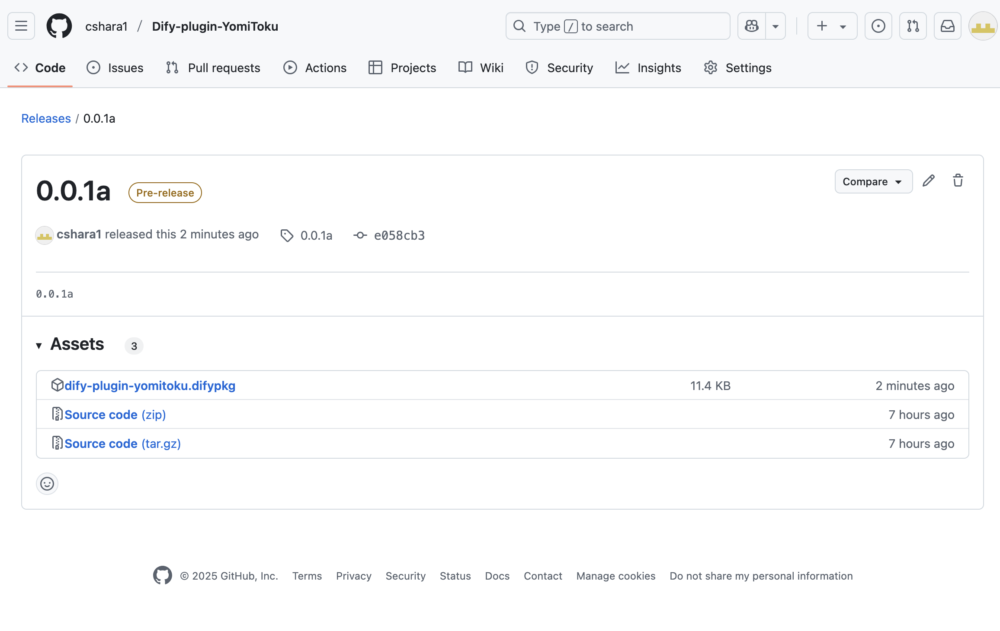
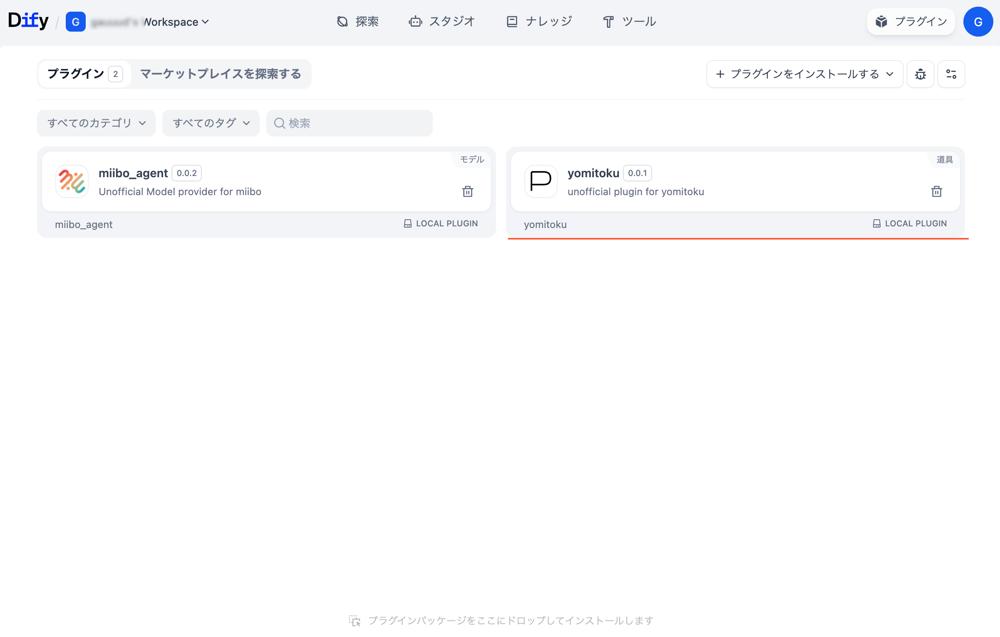
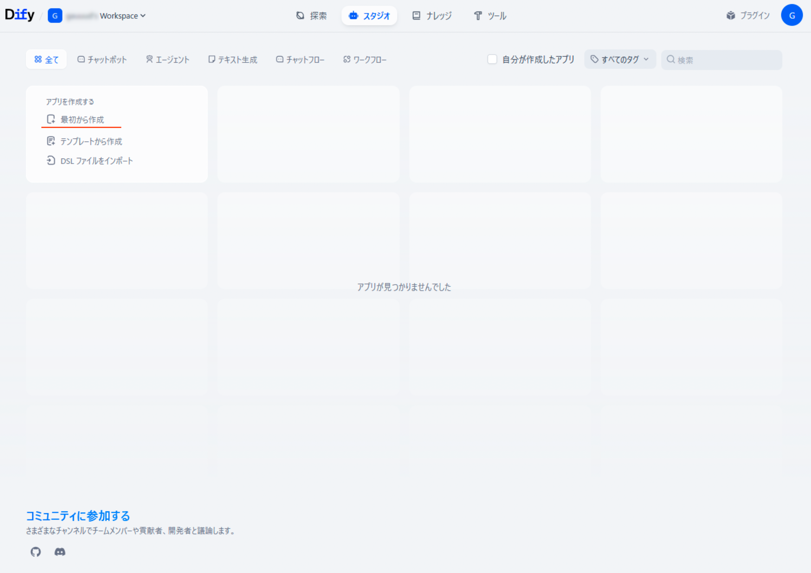
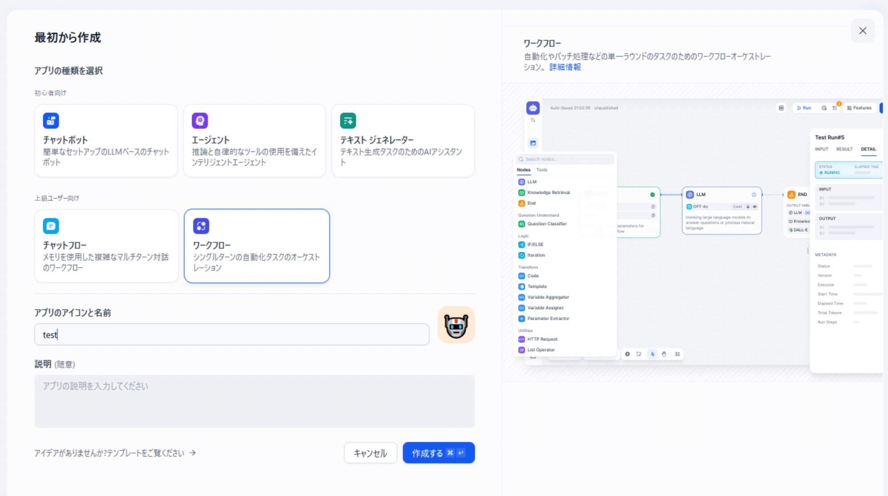
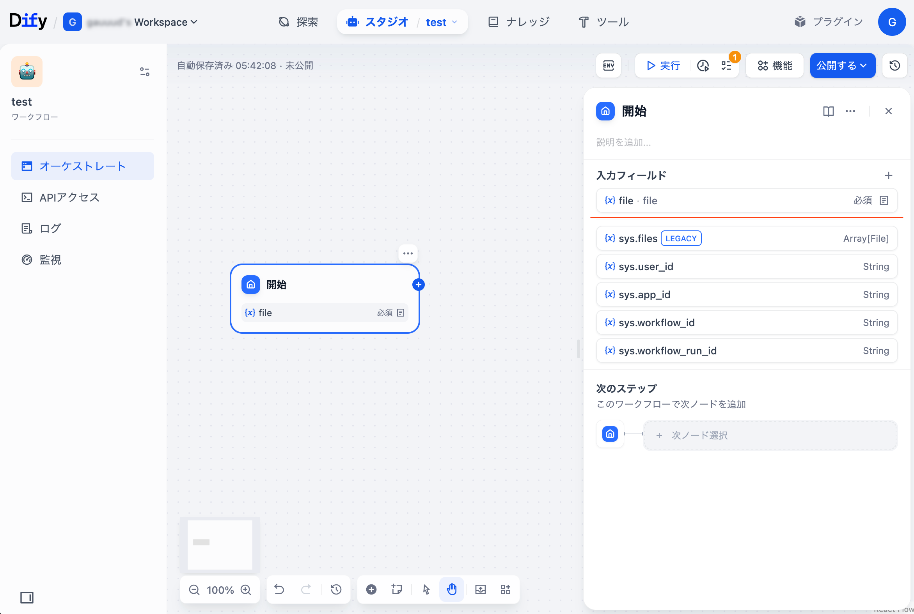
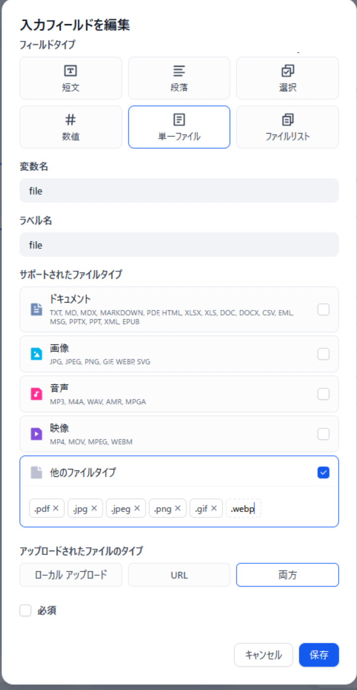
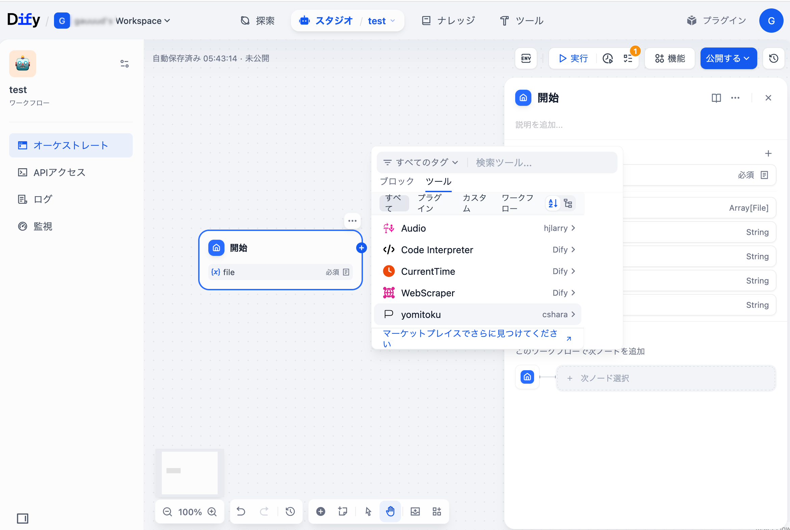
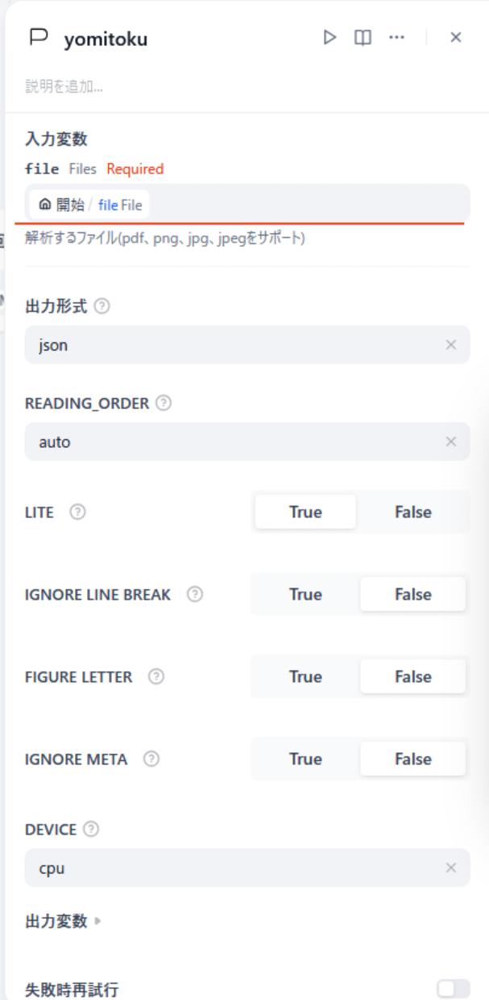
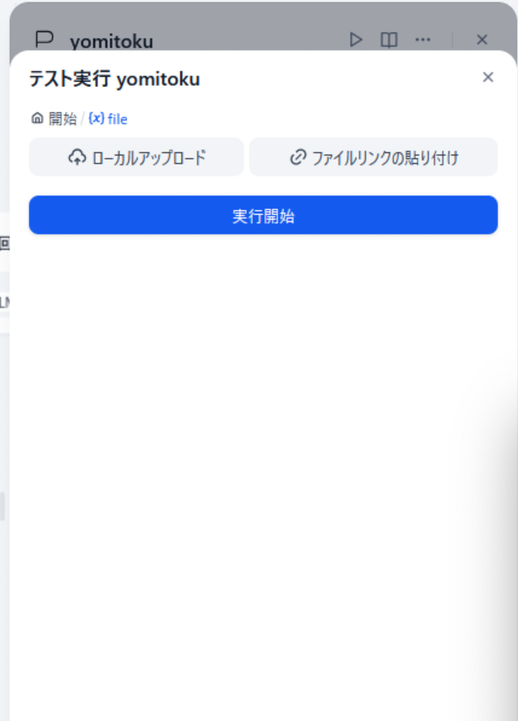
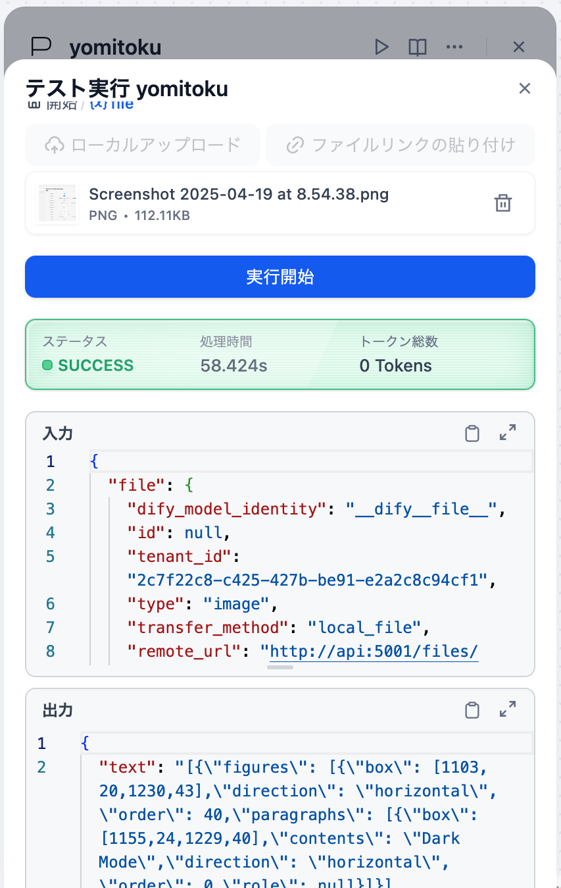

## 📝 実装機能
- YomiTokuバージョン：[v0.9.1](https://github.com/kotaro-kinoshita/yomitoku/releases/tag/v0.9.1)
<table><thead>
  <tr>
    <th><a href="https://github.com/kotaro-kinoshita/yomitoku?tab=readme-ov-file#-%E5%AE%9F%E8%A1%8C%E6%96%B9%E6%B3%95" target="_blank">YomiToku機能</a></th>
    <th>Dify-plugin-YomiToku対応</th>
  </tr></thead>
<tbody>
  <tr>
    <td>ヘルプの参照</td>
    <td>N/A</td>
  </tr>
   <tr>
    <td>解析結果の可視化</td>
    <td>N/A</td>
  </tr>
  <tr>
    <td>軽量モードでの実行</td>
    <td>LITE</td>
  </tr>
  <tr>
    <td>出力フォーマットの指定</td>
    <td>OUTPUT_FORMAT</td>
  </tr>
  <tr>
    <td>出力デバイスの指定</td>
    <td>DEVICE</td>
  </tr>
  <tr>
    <td>改行の無視</td>
    <td>IGNORE _LINE_BREAK</td>
  </tr>
  <tr>
    <td>図やグラフ画像の出力</td>
    <td>N/A</td>
  </tr>
  <tr>
    <td>図や画像内に含まれる文字の出力</td>
    <td>FIGURE_LETTER</td>
  </tr>
  <tr>
    <td>出力ファイルの文字コードの指定</td>
    <td>N/A</td>
  </tr>
  <tr>
    <td>コンフィグのパスの指定</td>
    <td>N/A</td>
  </tr>
  <tr>
    <td>メタ情報を出力ファイルに加えない</td>
    <td>IGNORE_META</td>
  </tr>
  <tr>
    <td>複数ページを統合する</td>
    <td>N/A</td>
  </tr>
  <tr>
    <td>読み取り順を指定する</td>
    <td>N/A</td>
  </tr>
</tbody>
</table>

## 👨‍💻 インストール手順
<details>
<summary>0.0.1a-Dify1.4.0_JP_HowTo（クリックで展開）</summary>

## 1. 最小システム要件
 - CPU：2Core
 - メモリ：4GB（推奨8GB以上）


## 2. Difyローカルでの環境構築

1. Dify 1.4.0をcloneします

    ```
    git clone https://github.com/langgenius/dify.git
    cd dify
    git checkout 1.4.0
    ```

2. 移動と.envのコピー

    ```
    cd docker
    sudo cp .env.example .env
    ```


3. pluginの証明チェックをオフにします
 - docker/.envを変更

   ```
   FORCE_VERIFYING_SIGNATURE=false
   ```

4. プラグインに関するタイムアウトの変更（1.4.0）
 - docker/.envを変更

   ```
   PLUGIN_PYTHON_ENV_INIT_TIMEOUT=3600
   PLUGIN_MAX_EXECUTION_TIMEOUT=1800
   ```

   値は環境に合わせてください単位は秒

4. プラグインでファイルを読み取る設定（1.4.0）
  
 - docker/.envを変更
   ```
   FILES_URL=http://api:5001
   ```

5. 実行

    ```
    cd dify/docker
    docker compose up -d
    ```


## 4. Pluginのインストール

1. 「Dify-plugin-YomiToku」リポジトリから```dify-plugin-yomitoku.difypkg```をダウンロードする。  
  場所：```~/dify-plugin-yomitoku/releases/tag/{最新リリースタグ:(2025.5.22時点)0.0.1a}```[🔗]((https://github.com/cshara1/Dify-plugin-YomiToku/releases/tag/0.0.1a))



2. Difyのpluginsページで```dify-plugin-yomitoku.difypkg```をインストールします
 - ```LocalPackageFile（difypkg）```を選択
 - ```dify-plugin-yomitoku.difypkg```をアップロード
 - ```Install from Local Package File```が開始される
<image src="./images/plugin_install.png" />

> [!TIP]
> ℹ️ 少し時間がかかりますのでインストールされるまで待ちます。
    dify-plugin-daemonコンテナの出力を確認し、
    終わらない場合はインターネット環境などを見直してください。
>
> ℹ️ 現在時間のかかるプラグインのインストール終了後に一覧に表示されないというバグが見られます。
    20分ほど経過して次のような表示がdify-plugin-daemonのコンテナの出力にありましたら、
    もう一度difypkgをインストールすると一覧に表示されるようになります。
`[INFO]plugin cshara/yomitoku:0.0.1: Installed tool: yomitoku`


（インストール完了）



## 5. 動作確認

1. Difyのスタジオから"最初から作成"を選択します
 

2. ワークフローを選択し名前を入力して作成します
 
 
3. 開始ノードに入力フィールド,file,単一ファイルを追加します
 
 次のような設定です<br>
 

4. 次のノードにYomiTokuを追加します
 
   ノードの設定をします、前のノードで作成したfileを入力変数に指定します<br>
 
   
5. テスト実行
   ▶️このステップを実行を実行して確認します
 
 


## 6.　出力
"text"にYomiToruから出力されるjsonを出力します


</details>
